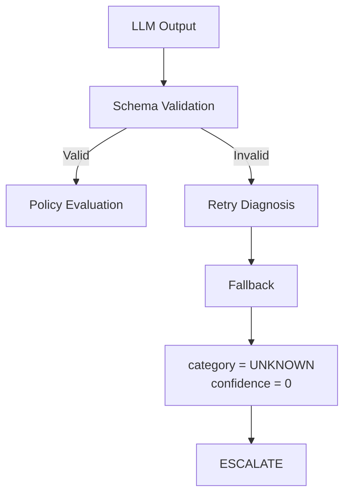

# Revive AI
> AI-powered revenue recovery for failed payments — with deterministic guardrails around every automated action.

**Razorpay AI Buildathon 2026 · Track 03 — AI Revenue Recovery**

## What is Revive AI ?
Revive AI turns failed payments into controlled recovery decisions.

Instead of blindly retrying every failed payment, Revive:

1. Validates the payment event
2. Uses AI to diagnose the likely failure reason
3. Applies deterministic financial and safety policies
4. Decides whether to retry, stop, or escalate
5. Executes only approved actions
6. Records the complete decision trail
7. Measures recovery, cost, and safety outcomes

### Core principle

> **AI diagnoses. Rules decide. Execution is guarded. Everything is audited.**

## The Problem

Failed payments are not all equal.

A temporary network failure may be recoverable.  
An expired card may require a different retry strategy.  
Insufficient funds may justify delayed retries.  
A fraud/security hold should not be blindly retried.  
A low-value payment may not justify another recovery attempt.

A naive "retry everything" strategy can therefore:

- waste payment attempts
- repeatedly retry unsafe transactions
- violate retry limits
- increase operational/payment costs
- create poor customer experiences
- make it difficult to explain why a payment was retried

Revive treats payment recovery as a **risk- and economics-constrained decision problem**.

## The Solution

Revive separates probabilistic AI reasoning from deterministic financial authority.

### AI layer

The LLM only determines:

- Failure category
- Confidence
- Reasoning

### Policy layer

Deterministic Python logic decides:

- Retry
- Stop
- Escalate to human
- Retry timing

### Execution layer

Only policy-approved actions reach the executor.

### Audit layer

Every important state transition and decision is recorded.

```text
Failed Payment
      ↓
Validation
      ↓
AI Diagnosis
      ↓
Deterministic Policy
      ↓
 ┌──────────┬───────────┬──────────┐
 │  RETRY   │ ESCALATE  │   STOP   │
 └──────────┴───────────┴──────────┘
      ↓
Guarded Execution
      ↓
Audit Trail
      ↓
Business Metrics

```

## Results
500-Event Synthetic Benchmark
| Metric                                |            Revive |
| ------------------------------------- | ----------------: |
| Events processed                      |           **500** |
| Revenue at risk                       | **₹19,87,156.17** |
| Gross revenue recovered               |  **₹6,40,757.39** |
| Retry cost                            |          **₹582** |
| Net revenue recovered                 |  **₹6,40,175.39** |
| Gross recovery rate                   |        **32.24%** |
| Recovery attempts                     |           **291** |
| Successful recoveries                 |           **158** |
| Attempt success rate                  |        **54.30%** |
| Human escalations                     |   **91 (18.20%)** |
| Value withheld from unsafe automation |  **₹7,93,054.49** |
These results come from the current synthetic benchmark and simulated executor. They demonstrate system behavior and are not claims of production merchant performance.

## AI Diagnosis Performance
| Metric                     |        Result |
| -------------------------- | ------------: |
| Events evaluated           |       **500** |
| Correct diagnoses          |       **482** |
| Diagnosis accuracy         |    **96.79%** |
| Fallback diagnoses         | **2 (0.40%)** |
| Validation failures caught |         **9** |
| Provider failures          |         **0** |
| API calls                  |        **29** |
| Cache hits                 |       **478** |
The diagnosis cache reduced model calls from 500 potential diagnoses to only 29 API calls in this benchmark.

## Safety Guardrails
Revive does not optimize for maximum retry volume.

It optimizes for controlled recovery.
| Guardrail             | Rule                | Action       |
| --------------------- | ------------------- | ------------ |
| Economic floor        | Amount `< ₹100`     | **STOP**     |
| Retry cap             | `retry_count >= 3`  | **STOP**     |
| Fraud protection      | Fraud hold          | **ESCALATE** |
| Confidence protection | Confidence `< 0.55` | **ESCALATE** |
| Unknown diagnosis     | Unknown / fallback  | **ESCALATE** |
Example:
₹5,000 payment
      +
Fraud hold
      +
LLM confidence = 0.99
      ↓
Deterministic Policy
      ↓
ESCALATE TO HUMAN
      ↓
NO AUTOMATIC RETRY
The LLM cannot override these rules.

## Revive vs Naive Retry
To evaluate the safety/recovery trade-off, the exact same 500 synthetic events were evaluated under two strategies.
| Metric                    |  Naive Retry |       Revive |
| ------------------------- | -----------: | -----------: |
| Attempts                  |          500 |      **291** |
| Gross recovered           | ₹8,44,938.34 | ₹6,40,757.39 |
| Recovery rate             |       42.52% |   **32.24%** |
| Fraud-hold retries        |          113 |        **0** |
| Retry-cap violations      |          118 |        **0** |
| Economic-floor violations |            1 |        **0** |

What this shows

Naive retry recovered more raw simulated revenue because it attempted every event.

Revive intentionally sacrifices some gross recovery in order to enforce:
-fraud protection
-retry limits
-economic constraints
-confidence-based escalation

The objective is therefore not:

"Retry as many payments as possible."

It is:
"Recover payments where automated recovery is justified, while preventing unsafe or uneconomic actions."

## Failure Diagnosis
Revive categorizes failed payments into:

NETWORK_ERROR
INSUFFICIENT_FUNDS
EXPIRED_CARD
MANDATE_FAILURE
FRAUD_HOLD
UNKNOWN
The model response is validated using a strict Pydantic schema.
Invalid model output does not directly reach the policy engine.

                   

This creates a fail-safe AI boundary.

## Category-Aware Recovery
Revive does not use one retry strategy for every failure.

| Failure Type       | One-off            | Subscription       |
| ------------------ | ------------------ | ------------------ |
| Network error      | Immediate          | 24h → 72h          |
| Insufficient funds | 24h                | 24h → 72h          |
| Expired card       | 72h                | 24h → 72h          |
| Mandate failure    | Policy-controlled  | 24h → 72h          |
| Unknown            | No automatic retry | No automatic retry |
All category-specific strategies remain subject to the global safety guardrails.

# Recovery by Failure Category
| Failure Type       | Events | Revenue at Risk |    Recovered |    Recovery Rate |
| ------------------ | -----: | --------------: | -----------: | ---------------: |
| Network error      |    115 |    ₹4,66,745.37 | ₹3,10,004.82 |       **66.42%** |
| Mandate failure    |     61 |    ₹1,53,785.12 |   ₹68,351.41 |       **44.45%** |
| Insufficient funds |    116 |    ₹5,09,731.55 | ₹1,50,678.78 |       **29.56%** |
| Expired card       |     93 |    ₹3,84,878.35 | ₹1,11,722.38 |       **29.03%** |
| Fraud hold         |    113 |    ₹4,57,926.05 |           ₹0 | **0% by design** |
Network failures perform best in this synthetic batch because they are modeled as transient failures.

Fraud holds have zero automated recovery by design.

# Recovery by Payment Type
| Metric            |       One-off | Subscription |
| ----------------- | ------------: | -----------: |
| Events            |           258 |          242 |
| Revenue at risk   | ₹13,34,921.14 | ₹6,52,235.03 |
| Net recovered     |  ₹4,02,193.47 | ₹2,37,981.92 |
| Net recovery rate |        30.13% |   **36.49%** |
Subscription payments show a higher observed recovery rate in this synthetic batch.

This experiment does not establish that retry cadence alone caused this difference.

## Idempotation Execution
Duplicate payment events should not result in duplicate recovery attempts.

Revive uses the event ID as an idempotency key in the execution layer.

Event A
   ↓
Execute
   ↓
SUCCESS

Event A
   ↓
Duplicate ID detected
   ↓
SKIP

The current implementation uses an in-memory idempotency set.

A production implementation would move this guarantee to durable storage/payment-provider infrastructure with atomic uniqueness enforcement.

## Auditability
Every major workflow stage is recorded in an append-only JSONL audit trail.

RECEIVED
   ↓
VALIDATED
   ↓
DIAGNOSING
   ↓
DIAGNOSED
   ↓
DECIDING
   ↓
DECIDED
   ↓
EXECUTING
   ↓
COMPLETED
For stopped or escalated events, execution is skipped but the decision remains auditable.
This lets operators answer:
Why was this payment retried?

not just:
Did this payment recover?

## Architecture
                  FAILED PAYMENT
                         │
                         ▼
                ┌─────────────────┐
                │ Event Validation│
                │    Pydantic     │
                └────────┬────────┘
                         │
                         ▼
                ┌─────────────────┐
                │   FSM Workflow  │
                └────────┬────────┘
                         │
                         ▼
              ┌──────────────────────┐
              │    AI DIAGNOSIS      │
              │                      │
              │ Category             │
              │ Confidence           │
              │ Reasoning            │
              └──────────┬───────────┘
                         │
                         ▼
              ┌──────────────────────┐
              │ DETERMINISTIC POLICY │
              │                      │
              │ Economic floor       │
              │ Retry cap            │
              │ Fraud protection     │
              │ Confidence threshold│
              │ Category strategy    │
              └──────────┬───────────┘
                         │
                ┌────────┼────────┐
                ▼        ▼        ▼
              RETRY   ESCALATE   STOP
                │        │        │
                ▼        │        │
        ┌──────────────┐ │        │
        │  Executor    │ │        │
        │ + Idempotency│ │        │
        └──────┬───────┘ │        │
               └─────────┼────────┘
                         ▼
                ┌─────────────────┐
                │   Audit Trail   │
                └────────┬────────┘
                         ▼
                ┌─────────────────┐
                │    Reporting    │
                └─────────────────┘
## Project Structure
revive-ai/
│
├── app/
│   ├── main.py              # FastAPI application
│   ├── schema.py            # Pydantic models + enums
│   ├── fsm.py               # Recovery state machine
│   ├── llm_agent.py         # AI diagnosis
│   ├── policy_engine.py     # Deterministic policy
│   ├── executor.py          # Simulated execution + idempotency
│   ├── orchestrator.py      # End-to-end workflow
│   ├── audit_log.py         # JSONL audit trail
│   ├── reporting.py         # Recovery metrics
│   └── generate_data.py     # Synthetic payment generation
│
├── data/
│   └── audit_log.jsonl
│
├── experiment_results/
│   └── experiment_*.json
│
├── experiments/
│
├── tests/
│
├── requirements.txt
└── README.md

## API
| Endpoint                    | Description                    |
| --------------------------- | ------------------------------ |
| `GET /`                     | Interactive recovery dashboard |
| `GET /health`               | Application health check       |
| `POST /run-batch?count=500` | Run synthetic recovery batch   |
| `GET /audit-log/{event_id}` | Inspect event audit history    |
| `GET /experiment/latest`    | Retrieve latest benchmark      |

## Run Locally

# 1. Clone
git clone https://github.com/revathikrishapk/revive-ai.git
cd revive-ai

# 2. Create Virtual Environment
Windows
python -m venv .venv
.venv\Scripts\activate
macOS / Linux
python3 -m venv .venv
source .venv/bin/activate

# 3. Install dependencies
pip install -r requirements.txt

# 4. Configure LLM
Create .env:
OPENROUTER_API_KEY=your_key_here
OPENROUTER_MODEL=openrouter/free

# 5. Start
uvicorn app.main:app --reload
Open
http://127.0.0.1:8000

## Testing
pytest -q
Tests cover important recovery and safety behavior including:

-economic floor
-retry cap
-fraud hold
-low confidence
-safe retry decisions
-invalid diagnosis output
-confidence validation
-subscription retry cadence
-duplicate execution
-execution failure handling

## Experiment Methodology
The benchmark evaluates two strategies on the same 500 synthetic events:

# Strategy 1 — Naive Retry

Attempt recovery for every event.

# Strategy 2 — Revive
Diagnose
   ↓
Apply guardrails
   ↓
Retry / Stop / Escalate

Synthetic ground truth is used only by the evaluator to measure diagnosis accuracy.

It is not supplied to the LLM or policy engine as decision input.

Recovery outcomes are deterministic and simulated.

Therefore, the benchmark demonstrates:

system behavior
policy enforcement
diagnosis performance on synthetic data
recovery/cost trade-offs
safety violations avoided

It does not claim production recovery uplift.

## What Is Real vs Simulated?
Capability	Status
Event validation	✅ Implemented
State machine	✅ Implemented
AI diagnosis	✅ Implemented
Deterministic policy	✅ Implemented
Guardrails	✅ Implemented
Idempotency	✅ Prototype implementation
Audit logging	✅ Implemented
Reporting	✅ Implemented
Dashboard	✅ Implemented
Payment events	🧪 Synthetic
Payment execution	🧪 Simulated
Real money movement	❌ None
Real payment gateway	❌ Not connected
Human-review queue	🧪 Modeled as escalation

## Production Roadmap
# Phase 1 — Integration
Real payment-provider/webhook ingestion
Authenticated event processing
Single-event recovery API
Real payment execution

# Phase 2 — Reliability
Durable workflow state
Database-backed idempotency
Concurrent-event handling
Provider/model failover
Retry scheduling

# Phase 3 — Intelligence
Historical payment-data evaluation
Confidence calibration
Merchant-specific recovery policies
Offline replay evaluation
Model quality monitoring

# Phase 4 — Operations
Human-review queue
Notifications
Monitoring
Tracing
Alerting
Recovery-cost optimization

The core safety boundary remains unchanged:

Probabilistic AI
      ↓
Deterministic Financial Policy
      ↓
Guarded Execution

## Design Principles
1. AI should not directly control money

The LLM diagnoses; deterministic policy authorizes.

2. Failure should be safe

If diagnosis fails, the system should become more conservative—not more aggressive.

3. Every automated action should be explainable

Store the diagnosis, policy decision, reason, and execution outcome.

4. Recovery should consider economics

A successful retry is not automatically a good retry.

5. Safety should be measurable

Don't just claim guardrails exist. Measure violations avoided.

## Key Takeaway

Revive AI doesn't use AI to blindly retry more payments. It uses AI to understand why a payment failed, deterministic policy to decide whether recovery is justified, guarded execution to prevent duplicate or unsafe actions, and measurable experiments to quantify the recovery/safety trade-off.


