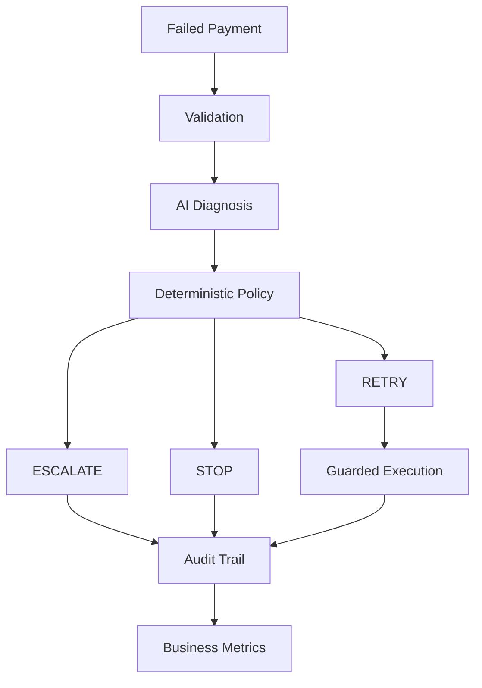
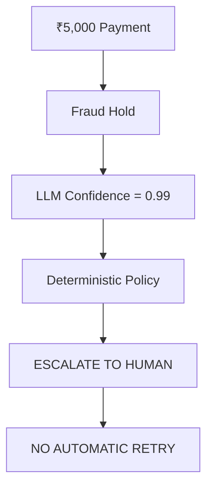
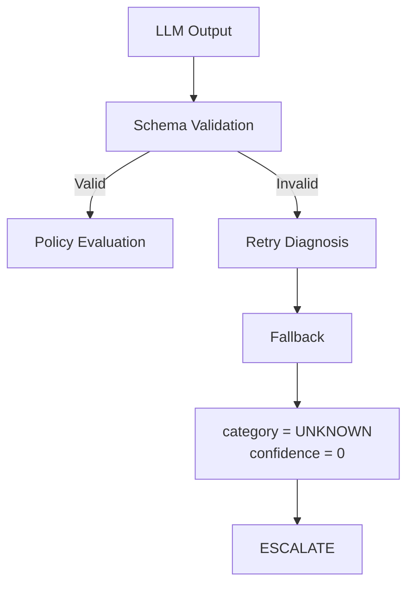
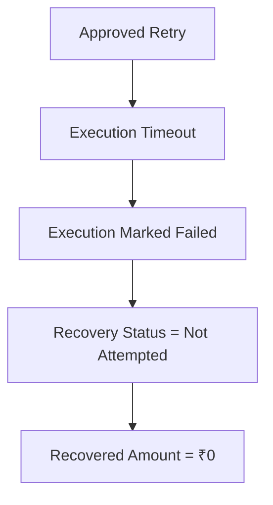
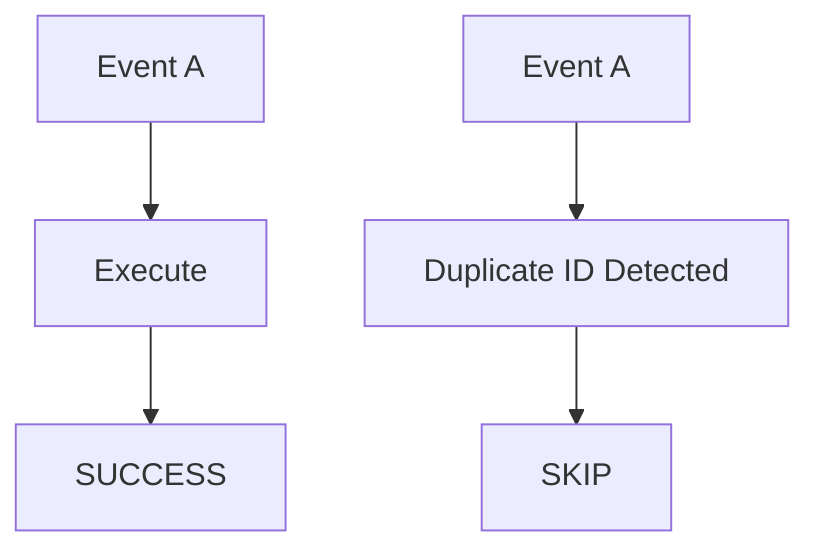
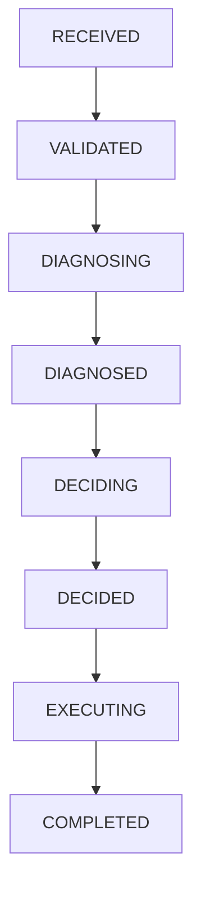
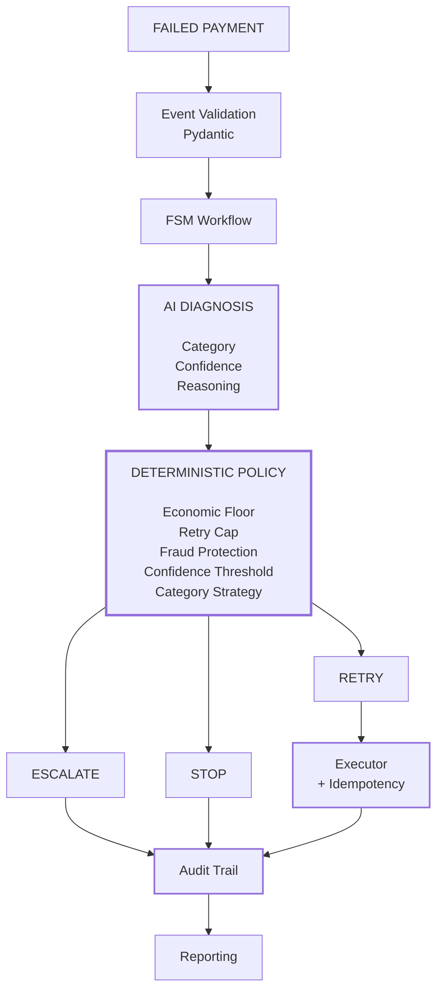
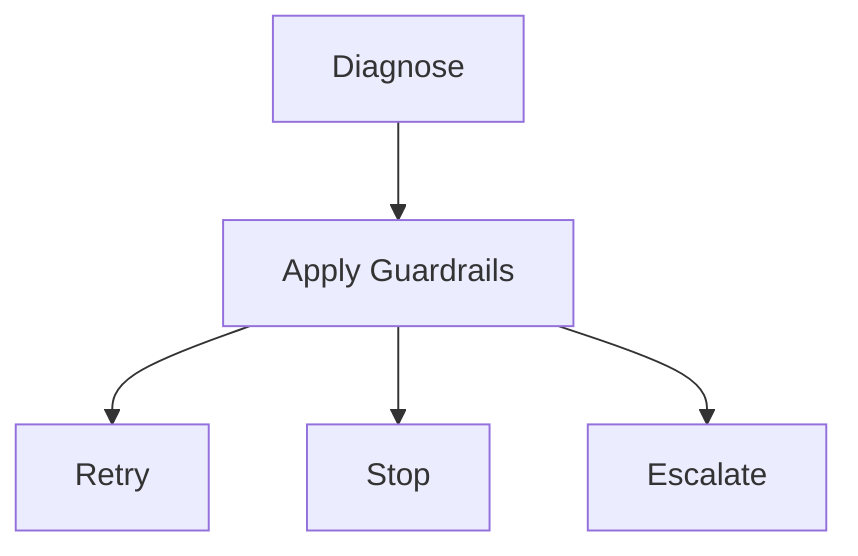
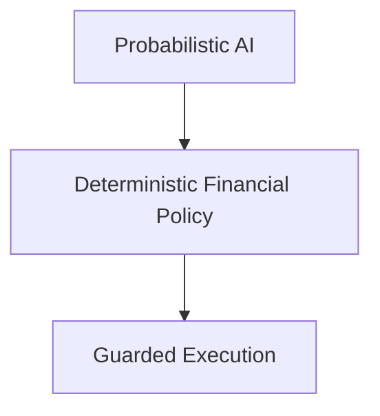

# Revive AI
> AI-powered revenue recovery for failed payments — with deterministic guardrails around every automated action.

**Razorpay AI Buildathon 2026 · Track 03 — AI Revenue Recovery**

[Demo Video](https://youtu.be/1DK_B6tsThU)

---
## What is Revive AI?
Revive AI turns failed payments into controlled recovery decisions.

Instead of blindly retrying every failed payment, Revive:

1. Validates the payment event
2. Uses AI to diagnose the likely failure reason
3. Applies deterministic financial and safety policies
4. Decides whether to retry, stop, or escalate
5. Executes only approved actions
6. Records the complete decision trail
7. Measures recovery, cost, and safety outcomes

### Core principle

> **AI diagnoses. Rules decide. Execution is guarded. Everything is audited.**

---
## The Problem

Failed payments are not all equal.

A temporary network failure may be recoverable.
An expired card may require a different retry strategy.
Insufficient funds may justify delayed retries.
A fraud/security hold should not be blindly retried.
A low-value payment may not justify another recovery attempt.

A naive "retry everything" strategy can therefore:

- Waste payment attempts
- Repeatedly retry unsafe transactions
- Violate retry limits
- Increase operational/payment costs
- Create poor customer experiences
- Make it difficult to explain why a payment was retried

Revive treats payment recovery as a **risk- and economics-constrained decision problem**.

## The Solution

Revive separates probabilistic AI reasoning from deterministic financial authority.

### AI layer
The LLM only determines:
- Failure category
- Confidence
- Reasoning

### Policy layer
Deterministic Python logic decides:
- Retry
- Stop
- Escalate to human
- Retry timing

### Execution layer
Only policy-approved actions reach the executor.

### Audit layer
Every important state transition and decision is recorded.



---
## Results — Recorded 500-Event Demo Run
*These figures are from the 500-event recovery run shown in the demo video. Experiment 019, below, is a separate frozen benchmark used for reproducible safety comparison and should not be compared row-for-row with these numbers.*

| Metric | Result |
|---|---:|
| Events processed | **500** |
| Revenue at risk | **₹19.2 lakh** |
| Gross recovered | **₹6.5 lakh** |
| Recovery rate | **33.56%** |

---
## Results — Frozen Experiment 019: Revive vs. Naive Retry

*This is a separate, reproducible 500-event benchmark, run under two strategies for direct comparison. It is independent of the demo-video run above.*

| Metric | Naive Retry | Revive |
|---|---:|---:|
| Events | 500 | 500 |
| Attempts | 500 | **291** |
| Gross recovered | ₹8,44,938.34 | ₹6,40,757.39 |
| Overall recovery rate† | 42.52% | **32.24%** |
| Safe recovery rate‡ | 52.36% | **53.40%** |
| Fraud-hold retries | 113 | **0** |
| Retry-cap violations | 118 | **0** |
| Economic-floor violations | 1 | **0** |


 ### *Overall recovery rate = gross recovered ÷ total ₹19,87,156.17 at risk across all 500 events.*

###  *Safe recovery rate = gross recovered ÷ the ₹12,00,017.57 subset of "fair recovery opportunities" in the benchmark — i.e. excluding events (fraud holds, retry-cap violations, economic-floor violations) that should never have been automatically pursued in the first place. On those fair opportunities, Revive recovered ₹6,40,757.39 (53.40%) versus ₹6,28,307.64 (52.36%) under the naive strategy.*

### **Headline result: +1.04 percentage points safe recovery rate, with 232 unsafe retries prevented** (113 fraud-hold retries + 118 retry-cap violations + 1 economic-floor violation).

### What this shows

Naive retry recovers more gross simulated revenue because it attempts every event, with no regard for whether the attempt is safe or economically sound. Revive intentionally does not retry everything — it trades some gross recovery for fraud protection, retry limits, economic constraints, and confidence-based escalation.

The goal is not maximum retry volume. The goal is **controlled recovery**.

---
## AI Diagnosis Performance — Experiment 019


| Metric | Result |
|---|---:|
| Diagnoses evaluated | **498** |
| Correct diagnoses | **482** |
| Diagnosis accuracy | **96.79%** |
| Fallback diagnoses | **2 (0.40%)** |
| Validation failures caught | **9** |
| Provider failures | **0** |
| API calls | **29** |
| Cache hits | **478** |


The diagnosis cache reduced 500 potential model calls to 29 API calls in this benchmark, with 478 cache hits.

---
## Safety Guardrails

Revive does not optimize for maximum retry volume. It optimizes for controlled recovery.

| Guardrail | Rule | Action |
|---|---|---|
| Economic floor | Amount `< ₹100` | **STOP** |
| Retry cap | `retry_count >= 3` | **STOP** |
| Fraud protection | Fraud hold | **ESCALATE** |
| Confidence protection | Confidence `< 0.55` | **ESCALATE** |
| Unknown diagnosis | Unknown / fallback | **ESCALATE** |

### Example: Fraud Hold Overrides AI Confidence



The LLM cannot override these rules.

---
## Failure Diagnosis

Revive categorizes failed payments into:
- `NETWORK_ERROR`
- `INSUFFICIENT_FUNDS`
- `EXPIRED_CARD`
- `MANDATE_FAILURE`
- `FRAUD_HOLD`
- `UNKNOWN`

The model response is validated using a strict Pydantic schema. Invalid model output does not directly reach the policy engine.



This creates a fail-safe AI boundary.

## Deliberate Failure Injection

Revive also tests what happens when execution itself fails. A simulated execution timeout is injected into the executor.

Expected behaviour:



This ensures execution failures are not incorrectly reported as successful revenue recovery.

## Testing

Revive has a safety-focused automated test suite covering both policy guardrails and deliberate failure scenarios.

**Test result: 22 passed in 1.06s**

What is tested:
- Economic floor
- Retry cap
- Low-confidence escalation
- Fraud-hold protection
- Safe retry decisions
- Invalid AI confidence
- Invalid AI category
- Malformed AI diagnosis handling
- Subscription retry cadence
- Duplicate execution
- Idempotency protection
- Execution timeout failure injection

The test suite is designed to verify that Revive fails safely when individual components behave unexpectedly, rather than only testing the happy path.

---
## Category-Aware Recovery

Revive does not use one retry strategy for every failure.

| Failure Type | One-off | Subscription |
|---|---|---|
| Network error | Immediate | 24h → 72h |
| Insufficient funds | 24h | 24h → 72h |
| Expired card | 72h | 24h → 72h |
| Mandate failure | Policy-controlled | 24h → 72h |
| Unknown | No automatic retry | No automatic retry |

All category-specific strategies remain subject to the global safety guardrails.

## Recovery by Failure Category — Experiment 019

| Failure Type | Events | Revenue at Risk | Recovered | Recovery Rate |
|---|---:|---:|---:|---:|
| Network error | 115 | ₹4,66,745.37 | ₹3,10,004.82 | **66.42%** |
| Mandate failure | 45 | ₹1,12,416.46 | ₹68,351.41 | **60.81%** |
| Insufficient funds | 116 | ₹5,09,731.55 | ₹1,50,678.78 | **29.56%** |
| Expired card | 111 | ₹4,40,336.74 | ₹1,11,722.38 | **25.37%** |
| Fraud hold | 113 | ₹4,57,926.05 | ₹0 | **0% by design** |

Network failures perform best in this synthetic batch because they are modeled as transient failures. Fraud holds have zero automated recovery by design.

## Recovery by Payment Type — Experiment 019

| Metric | One-off | Subscription |
|---|---:|---:|
| Events | 246 | 254 |
| Revenue at risk | ₹12,47,068.74 (₹12.47 lakh) | ₹6,69,351.65 (₹6.69 lakh) |
| Recovered | ₹4,01,351.45 (₹4.01 lakh) | ₹2,39,405.94 (₹2.39 lakh) |
| Recovery rate | 32.18% | **35.76%** |

Subscription payments show a higher observed recovery rate in this synthetic batch. This experiment does not establish that retry cadence alone caused this difference.

---
## Idempotent Execution

Duplicate payment events should not result in duplicate recovery attempts. Revive uses the event ID as an idempotency key in the execution layer.



The current implementation uses an in-memory idempotency set. A production implementation would move this guarantee to durable storage/payment-provider infrastructure with atomic uniqueness enforcement.

## Auditability

Every major workflow stage is recorded in an append-only JSONL audit trail.



For stopped or escalated events, execution is skipped but the decision remains auditable. This lets operators answer *why* a payment was retried, not just *whether* it recovered.

## Architecture



## Project Structure

```text
revive-ai/
│
├── app/
│   ├── main.py              # FastAPI application
│   ├── schema.py            # Pydantic models + enums
│   ├── fsm.py               # Recovery state machine
│   ├── llm_agent.py         # AI diagnosis
│   ├── policy_engine.py     # Deterministic policy
│   ├── executor.py          # Simulated execution + idempotency
│   ├── orchestrator.py      # End-to-end workflow
│   ├── audit_log.py         # JSONL audit trail
│   ├── reporting.py         # Recovery metrics
│   └── generate_data.py     # Synthetic payment generation
│
├── data/
│   └── audit_log.jsonl      # Persistent audit trail
│
├── experiment_results/
│   └── experiment_*.json    # Experiment outputs
│
├── experiments/             # Evaluation experiments
│
├── tests/                   # Test suite
│
├── requirements.txt         # Python dependencies
└── README.md                # Project documentation
```

## API

| Endpoint | Description |
|---|---|
| `GET /` | Interactive recovery dashboard |
| `GET /health` | Application health check |
| `POST /run-batch?count=500` | Run synthetic recovery batch |
| `GET /audit-log/{event_id}` | Inspect event audit history |
| `GET /experiment/latest` | Retrieve latest benchmark |

## Run Locally

### 1. Clone the Repository
```bash
git clone https://github.com/revathikrishapk/revive-ai.git
cd revive-ai
```

### 2. Create a Virtual Environment

**Windows**
```bash
python -m venv .venv
.venv\Scripts\activate
```

**macOS / Linux**
```bash
python3 -m venv .venv
source .venv/bin/activate
```

### 3. Install Dependencies
```bash
pip install -r requirements.txt
```

### 4. Configure the LLM

Create a `.env` file in the project root:
```env
OPENROUTER_API_KEY=your_key_here
OPENROUTER_MODEL=openrouter/free
```

> **Security:** Never commit your `.env` file or expose your API key publicly. Add `.env` to `.gitignore`.

### 5. Start the Application
```bash
uvicorn app.main:app --reload
```

### 6. Open the Application

Visit `http://127.0.0.1:8000`

### Run Tests
```bash
pytest -q
```

---
## Experiment Methodology

The benchmark evaluates two strategies on the same 500 synthetic events:

**Strategy 1 — Naive Retry:** attempt recovery for every event.

**Strategy 2 — Revive:**


Synthetic ground truth is used only by the evaluator to measure diagnosis accuracy. It is not supplied to the LLM or policy engine as decision input. Recovery outcomes are deterministic and simulated.

Therefore, the benchmark demonstrates system behavior, policy enforcement, diagnosis performance on synthetic data, recovery/cost trade-offs, and safety violations avoided. **It does not claim production recovery uplift.**

## Real vs. Simulated Capabilities

| Capability | Status | Description |
|---|---|---|
| Event Validation | **Implemented** | Validates incoming payment events against defined schemas |
| Recovery State Machine | **Implemented** | Manages deterministic recovery states and transitions |
| AI Diagnosis | **Implemented** | Uses an LLM to diagnose payment failure scenarios |
| Deterministic Policy Engine | **Implemented** | Applies rule-based recovery and safety policies |
| Guardrails | **Implemented** | Enforces safety constraints before recovery actions |
| Idempotency | **Prototype** | Prevents duplicate recovery execution within the prototype |
| Audit Logging | **Implemented** | Records recovery decisions and execution events in JSONL format |
| Recovery Reporting | **Implemented** | Computes recovery and operational metrics |
| Monitoring Dashboard | **Implemented** | Displays recovery outcomes and system metrics |
| Payment Events | **Synthetic** | Generated locally for controlled experimentation |
| Payment Execution | **Simulated** | Recovery actions are executed against a simulated payment environment |
| Real Money Movement | **Not Connected** | No real financial transactions are performed |
| Payment Gateway | **Not Connected** | No production payment processor is integrated |
| Human Review Queue | **Modeled** | Escalation states are represented within the recovery workflow |

## Production Roadmap

| Phase | Focus | Key Deliverables |
|---|---|---|
| **Phase 1** | Payment Integration | Provider/webhook ingestion, authenticated events, recovery API, real payment execution |
| **Phase 2** | Reliability & Resilience | Durable state, database-backed idempotency, concurrency handling, failover, retry scheduling |
| **Phase 3** | Intelligence & Evaluation | Historical-data evaluation, confidence calibration, merchant-specific policies, offline replay, model monitoring |
| **Phase 4** | Operations & Observability | Human review, notifications, monitoring, tracing, alerting, recovery-cost optimization |

The core safety boundary remains unchanged:


## Design Principles

**1. AI Does Not Directly Control Money**
The LLM is responsible for diagnosis, not authorization. Deterministic policies govern whether a recovery action is permitted.

**2. Fail Safely**
When diagnosis is unavailable, invalid, or uncertain, the system defaults to a more conservative state rather than taking a more aggressive action.

**3. Make Every Decision Explainable**
Every recovery attempt records the diagnosis, policy decision, rationale, and execution outcome, creating an auditable decision trail.

**4. Optimize for Economic Recovery**
A technically successful retry is not necessarily a successful recovery. Recovery decisions should account for cost, expected outcome, and business impact.

**5. Measure Safety**
Guardrails should be measurable and testable, not merely documented. The system evaluates safety through metrics such as policy violations prevented and unsafe actions blocked.

## Key Takeaway

Revive AI doesn't use AI to blindly retry more payments. It uses AI to understand why a payment failed, deterministic policy to decide whether recovery is justified, guarded execution to prevent duplicate or unsafe actions, and measurable experiments to quantify the recovery/safety trade-off.
